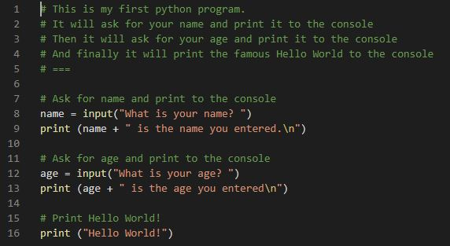

# Python Projects: Collection of Programs
> Various python programs.

## Table of contents
* [General info](#general-info)
* [Screenshots](#screenshots)
* [Technologies](#technologies)
* [Contact](#contact)

## General info
The purpose of the repository is to apply the coding language learnt so far to create programs.

This is a collection of python programs that I have code to exercise.

## Screenshots

## Technologies
* Python - version 3.8
* Visual Studio Code - version 1.41.0

## Contact
Created by [Francois Botha](https://github.com/francois-botha) - feel free to contact me!